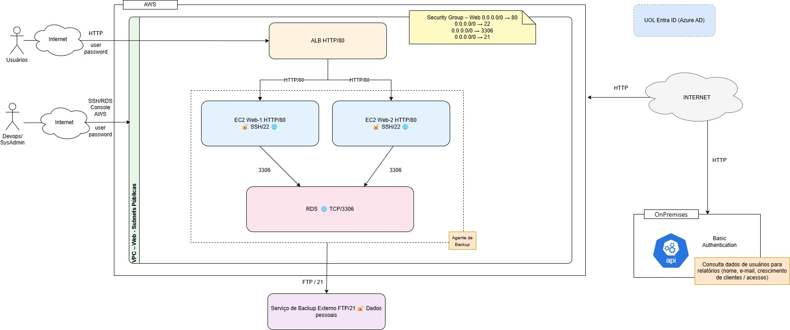

# Desafio 01 – Avaliação e Redesenho de Arquitetura (Security Design Review)
*Foco: arquitetura em AWS com integração on‑premises e exposição de API*

## Contexto

Você recebeu um ambiente AWS que atende uma aplicação web de produção.  
O desenho atual apresenta uma topologia funcional com camadas de aplicação, dados e integração com um ambiente on‑premises, além de mecanismos de administração e cópias de dados para um serviço externo.

**Objetivo:** produzir uma avaliação técnica da arquitetura atual e propor um redesenho que atenda princípios de segurança, confiabilidade e operação em nuvem.

---

## Referência Visual (As‑Is)

Utilize como base o diagrama a seguir (formato draw.io):

👉 **[docs/imagens/aws_diagrama.drawio](docs/imagens/aws_diagrama.drawio)**

> O arquivo pode ser aberto em https://app.diagrams.net

---

## Cenário Atual (As‑Is)

### Camada de Aplicação (AWS)
- A aplicação web é publicada por um **Application Load Balancer (ALB)**.
- Duas instâncias **EC2** compõem o web tier.
- O web tier está posicionado em **sub-redes públicas**.
- O acesso administrativo às instâncias é realizado por **SSH** a partir da Internet.

### Camada de Dados (AWS)
- O banco de dados é fornecido por **Amazon RDS**.
- A instância RDS encontra-se **exposta para a Internert**.

### Cópias de Dados (Serviço Externo)
- Há uma rotina de **envio de arquivos** para um **serviço de terceiros**, utilizando um **protocolo de transferência de arquivos tradicional**.

### Administração de Conta (AWS)
- A administração do ambiente na console AWS é feita com **usuários IAM locais**.
- Existe **Entra ID** no ambiente corporativo, sem integração ativa com a console AWS.

### Integração On‑Premises
- O ambiente **AWS** expõe uma **API** consumida pela aplicação no ambiente On‑Premises.
- O consumo dessa API ocorre **via Internet**.
- A **API** utiliza **Basic Authentication**.

### Contexto Funcional da Integração
- A API é utilizada para **consulta de informações de usuários** a fim de **gerar relatórios gerenciais** relacionados a:
- **Crescimento da base de clientes**; e
- **Variação no volume de acessos**.

---

## Tarefas

### 1) Análise do Cenário (As‑Is)
- Elabore uma **classificação de riscos** do cenário atual (probabilidade × impacto).
- Indique **prioridades de tratamento**.

### 2) Redesenho de Arquitetura (To‑Be)
- Produza um **novo diagrama (draw.io)** com a arquitetura proposta.
- Estruture por **camadas** e **limites de confiança** (Internet, Conta AWS, VPC, on‑premises, terceiros).
- Defina a **conectividade** entre AWS e on‑premises e os **mecanismos de autenticação/autorização** para o consumo da API on‑premises.
- Defina o **posicionamento de cargas** (público/privado), a **exposição de serviços**, **políticas de acesso** e **fluxos de dados**.
- Indique **mecanismos de proteção de dados**, conforme julgar adequados ao contexto.
- Inclua **observabilidade mínima** (logs/métricas/alertas) e **governança de identidade** apropriada.

### 3) Justificativas Técnicas
Para cada decisão relevante do To‑Be, descreva:
- O **objetivo** da mudança;
- Os **serviços/controles** escolhidos;
- **Impactos** esperados (operacionais, custo, complexidade).

### 4) Roadmap de Implantação
- Proponha um plano em fases (ex.: **imediato**, **30–60 dias**, **>90 dias**).
- Inclua um **plano de rollback** em alto nível.
- Liste **riscos residuais** e como seriam acompanhados.

---

## Entregáveis

1. **Diagrama As‑Is** (`.drawio`) — somente referência (não precisa alterar).  
2. **Diagrama To‑Be** (`.drawio`) — arquitetura proposta.  
3. **Documento curto (3–5 páginas) ou README** contendo:
   - Inventário e **classificação de riscos**;
   - **Decisões de arquitetura** (o que muda e por quê);
   - **Conectividade** AWS ↔ on‑premises e **mecanismos de autenticação/autorização** da API;
   - **Proteção de dados** (em trânsito/repouso) e **gestão de segredos/chaves**;
   - **Observabilidade/governança** no nível considerado adequado;
   - **Roadmap**, rollback e **riscos residuais**;
   - **Assunções** (premissas adotadas).

---

## Orientações

- **Não é necessário** escrever código IaC; o foco é **arquitetura**.  
- Caso faltem informações, registre **assunções** e siga com o desenho.  
- Mantenha diagramas e texto **enxutos e diretos**.

---

## Como Enviar

- Preferencial: **link para repositório Git** (público ou privado com acesso aos avaliadores).  
